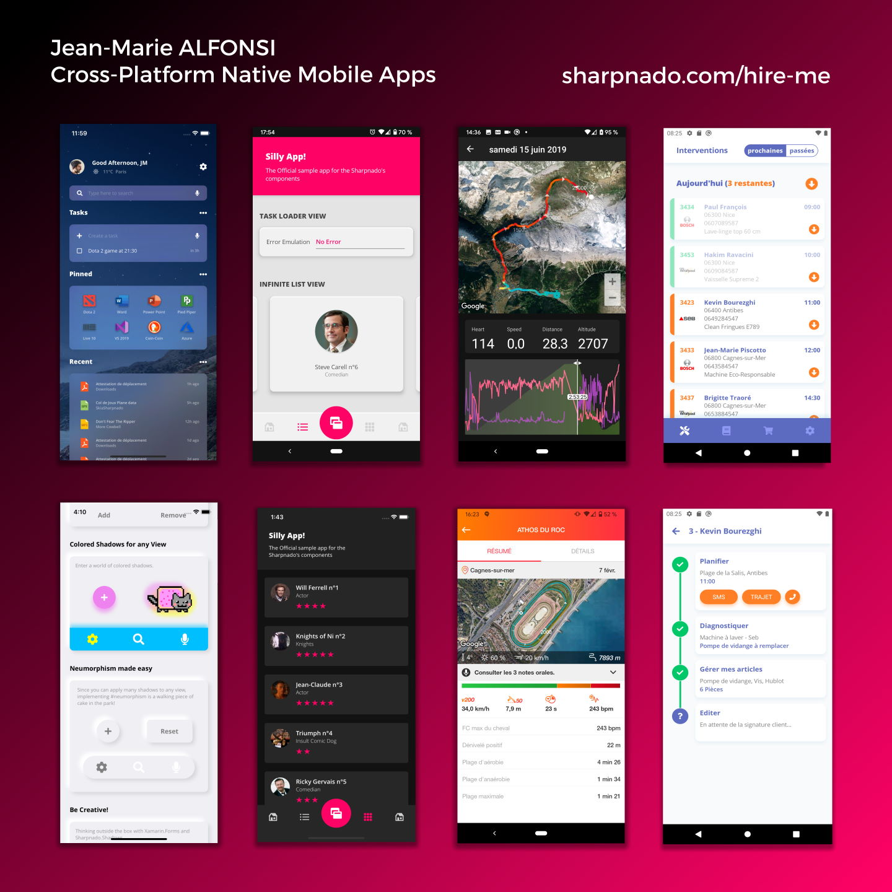

Hi I'm Jean-Marie, a silly mobile cross platform french freelance.

I'm the creator of www.sharpnado.com and like to build open source components.

I'm the founder of "Les Compagnons de l'App", https://codelapp.fr, which is an app studio gathering very experimented and talented builders.

You can reach me on twitter [@Piskariov](https://twitter.com/Piskariov) and on [LinkedIn](https://www.linkedin.com/in/alfonsi/).

